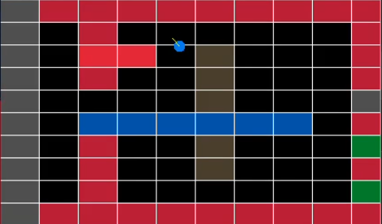

# Raycasting Engine

## Introduction
A simple and fast raycasting engine built using C++ and Raylib. It can run at 350+ FPS and has minimal 

### Demo
<video width="320" height="240" controls>
    <source src="res/raycasting_demo.mp4" type="video/mp4">
</video>

---

## Key Features

### 1. Controls
|Key   |	Action
|------|---------|
|W     | Move forward
|S 	   | Move backward
|A	   | Strafe left
|D	   | Strafe right
|Mouse | Look around
|Shift | Sprint


### 2. Map System
- Loaded from a .txt file

- Format:

    ```
    rows cols
    i j color_index
    i j color_index
    ...
    ```

It uses a predefined color palette (mapColors) and automatically generates boundary walls


### 3. Build & Run
1. Clone the Repo:

    ```git clone https://github.com/AbhaySDubey/raycast_engine.git```

    ```cd raycast_engine```

2. Build

    ```make```

    Compile targets are map_utils.cpp, operator_overloads.cpp and main.cpp. All ```*.o``` and ```*.exe``` files are stored in ```build/```

3. Run

    ```./build/game.exe/```

### 4. Minimap
It features a minimap that displays the map grid, player position and the direction vector

