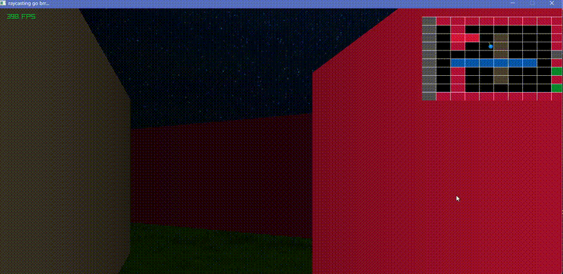

# Raycasting Engine
### A simple and fast raycasting engine built using C++ and Raylib, that can run at ***350+*** FPS.

## Introduction
Raycasting is a semi-3D (2.5D) perspective projection method that was used in many popular games such as Wolfenstein 3D, Doom (a modification of the raycasting engine was used here), etc.

**In this project, I've attempted to try my hand at implementing a simple and fast Wolfenstein-style Raycasting engine. The project uses `C++` for scripting and `Raylib` for graphics processing.**

### Demo


---

## Build & Run

### Project Structure

- `main.cpp`: handles the game loop, rendering pipeline, and player updates.
- `map_utils.cpp`: responsible for parsing map files and managing grid data.
- `operator_overloads.cpp`: defines vector and color operations used across the project.
- `res/`: contains textures and demo assets.
-  All `*.o` and `*.exe` files are stored in `build/`


1. Clone the Repo:

    `git clone https://github.com/AbhaySDubey/raycast_engine.git`

    `cd raycast_engine`

2. Build

    `make`

    Compile targets are map_utils.cpp, operator_overloads.cpp and main.cpp.

3. Run

    `./build/game.exe`

#### Note: This project uses [Raylib](https://www.raylib.com/) To run the project, change the `lib` and `include` folders to your raylib installation.

---

## Controls
|Key   |	Action
|------|--------------|
|W     | Move forward
|S 	   | Move backward
|A	   | Strafe left
|D	   | Strafe right
|Mouse | Look around
|Shift | Sprint

---

## How it works
The engine renders the scene column by column using a raycasting approach:

- For each vertical strip of the screen, a ray is cast from the player’s position.
- The ray is stepped through the grid using a Digital Differential Analysis (DDA) algorithm until it hits a wall.
- The distance to the wall is calculated and used to determine the height of the vertical slice to render.
- A simple shading model is applied based on distance and wall orientation to give a sense of depth.

---


## Map System
Maps are loaded from a .txt file and use the following format:
```
rows cols
i j color_index
i j color_index
...
```
The first line defines the grid dimensions. Each subsequent line represents a wall at position `(i, j)` with a color index from a predefined palette. Boundary walls are generated automatically.


### Minimap
It features a minimap that displays the map grid, player position and the direction vector.

[TO DO] make the minimap show the player FOV and shading, as well.


---

## Future Work
Some things I want to work on and develop in the future are:

- Texture mapping for walls instead of flat colors
- Adding enemies and enemy AI
- Improved lighting and shading models
- Field-of-view visualization on the minimap
- Sprites and glass visualization (i've seen some people visualize glass here, so i'd want to try that out)